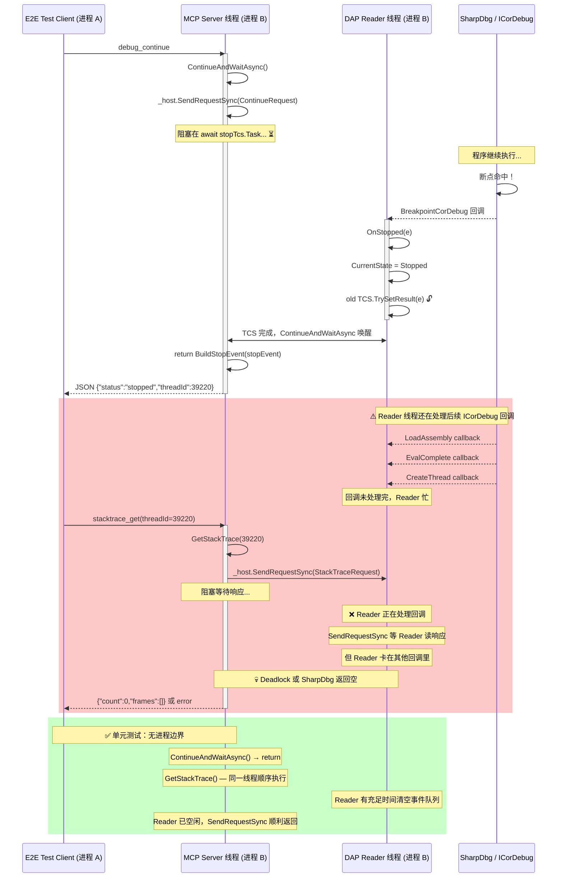

> **Status: FIXED** (commit fd17ca3). Root cause: `ContinueAndWaitAsync` sent a redundant `ContinueRequest` after attach because SharpDbg's `ConfigurationDone` already auto-continued the process. ICorDebug rejected it with `CORDBG_E_SUPERFLOUS_CONTINUE`. Fix: skip the initial `ContinueRequest` when `_lastStop.Reason == "attach"`.

**参与者说明：**

| 生命线 | 线程 | 职责 |
|--------|------|------|
| E2E Test Client | 进程 A，独立线程 | 发 MCP 请求，等 JSON 响应 |
| MCP Server 线程 | 进程 B | 处理 MCP 工具调用 → DebugSession 方法（ContinueAndWaitAsync, GetStackTrace 等都跑在这里） |
| DAP Reader 线程 | 进程 B | `DebugProtocolHost.Run()` 的消息循环，ICorDebug 回调 → OnStopped/OnExited |
| SharpDbg / ICorDebug | 进程 B 内 | .NET 调试引擎 |

**关键：只有两条线程。** `ContinueAndWaitAsync` 不是独立线程——它是 Server 线程上被阻塞的异步方法，等 Reader 线程完成 TCS 后恢复执行。

**根因：** Reader 线程一次只能做一件事。当它处理 ICorDebug 回调中，Client 发来新的 DAP 请求 → Server 线程调 `SendRequestSync` 阻塞 → 需要 Reader 读响应 → 但 Reader 还在处理上一个回调 → 僵住了。
